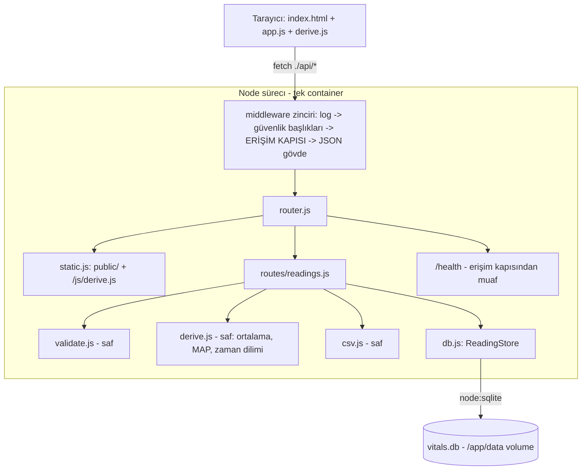
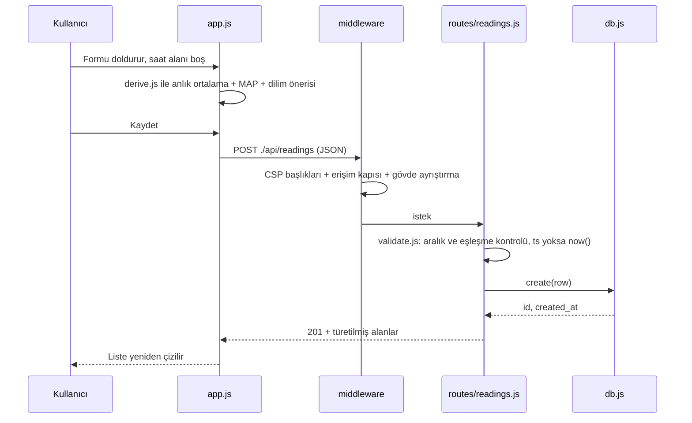

# 05 — Mimari Tasarım: vitals-log

- Tarih: 2026-08-10 | Mod: AUTOPILOT | Profil: LITE
- Girdi: `docs/03-requirements.md`, `docs/04-solution-analysis.md` (Karar A+D+G+I)

## Bileşen görünümü



**Modüller (dizin yapısı)**

| Yol | Sorumluluk | Bağımlılığı |
|-----|------------|-------------|
| `src/server.js` | `node:http` sunucusu, config, middleware zincirini kurar, mount prefix'i uygular, graceful shutdown | tümü |
| `src/config.js` | Env okuma + varsayılan: `PORT=3000`, `VITALS_DB=/app/data/vitals.db`, `MOUNT_PREFIX=""`, `ACCESS_KEY=""` | — |
| `src/middleware/` | `logger.js`, `securityHeaders.js` (CSP), **`accessGate.js` (Faz 7 doldurur — şimdilik geçirgen)**, `jsonBody.js` (≤64 KB), `errorHandler.js` | config |
| `src/router.js` | Yol eşleme (method+path → handler); statik + `/api` dallanması | routes, static |
| `src/routes/readings.js` | 5 API ucu; HTTP↔domain çevirisi, durum kodları | validate, derive, csv, db |
| `src/db.js` | `node:sqlite` bağlantısı, şema/migrasyon, `ReadingStore { list, get, create, update, remove }` — **SQL yalnız burada** | node:sqlite |
| `src/derive.js` | **Saf ES modülü**: `mean()`, `map()`, `periodFor(hour)`, `enrich(row)` — sunucu import eder, tarayıcıya `/js/derive.js` olarak servis edilir (tek kaynak) | yok |
| `src/csv.js` | Saf: `toCsv(rows)` — BOM + CRLF + tırnak kaçışı | derive |
| `src/validate.js` | Saf: alan aralıkları, sistolik↔diyastolik eşleşmesi, `ts` normalizasyonu | derive |
| `public/index.html`, `public/app.js`, `public/styles.css` | Tek sayfa istemci; **inline script YOK**, `fetch` göreli yol kullanır | /js/derive.js |

## Veri akışı (FR-1: kayıt ekleme)



## Veri modeli

Tek tablo (ilişki yok). Türetilmiş değerler (`*_mean`, `*_map`) **saklanmaz** — DL-04-003.

```sql
CREATE TABLE IF NOT EXISTS readings (
  id              INTEGER PRIMARY KEY AUTOINCREMENT,
  ts              TEXT    NOT NULL,                      -- ISO-8601 + sabit ofset: 2026-08-10T08:15:00+03:00
  time_period     TEXT    NOT NULL CHECK (time_period IN ('Sabah','Öğle','İkindi','Akşam','Yatsı')),
  right_systolic  INTEGER CHECK (right_systolic  BETWEEN 40 AND 300),
  right_diastolic INTEGER CHECK (right_diastolic BETWEEN 20 AND 200),
  left_systolic   INTEGER CHECK (left_systolic   BETWEEN 40 AND 300),
  left_diastolic  INTEGER CHECK (left_diastolic  BETWEEN 20 AND 200),
  fever           REAL    CHECK (fever   BETWEEN 30 AND 45),
  pulse           INTEGER CHECK (pulse   BETWEEN 20 AND 250),
  oxygen          INTEGER CHECK (oxygen  BETWEEN 50 AND 100),
  created_at      TEXT    NOT NULL,
  updated_at      TEXT    NOT NULL,
  CHECK (COALESCE(right_systolic, left_systolic, fever, pulse, oxygen) IS NOT NULL)  -- boş kayıt yasak
);
CREATE INDEX IF NOT EXISTS idx_readings_ts ON readings(ts);
PRAGMA journal_mode = WAL;   -- eşzamanlı okuma + dayanıklılık
PRAGMA synchronous = FULL;   -- NFR-4: commit sonrası kayıp yok (tek kullanıcı, yazım hacmi düşük)
```

- **Tüm ölçüm kolonları NULL kabul eder** (FR-1: ateş/nabız/oksijen opsiyonel); en az bir ölçüm zorunluluğu tablo CHECK'i ile depo düzeyinde.
- **Sıralama:** `ts` sabit `+03:00` ofsetiyle yazıldığından sözlüksel sıra = kronolojik sıra (`ORDER BY ts`). Container `TZ=Europe/Istanbul` (DST yok). `derive.periodFor(hour)` saati **parametre** alır → testler saat diliminden bağımsızdır.
- **Türetilen alanlar (API yanıtında + CSV'de):** `right_mean = (sys+dia)/2`, `right_map = dia + (sys-dia)/3`, sol kol için aynısı; 1 ondalık basamağa yuvarlanır. Kol verisi eksikse `null`.

### Zaman dilimi eşikleri (yerel saat, 24 saati kapsar)

| Dilim | Başlangıç | Bitiş | Not |
|-------|-----------|-------|-----|
| Sabah | 05:00 | 10:59 | |
| Öğle | 11:00 | 14:59 | |
| İkindi | 15:00 | 17:59 | |
| Akşam | 18:00 | 20:59 | |
| Yatsı | 21:00 | 04:59 | Gece yarısını sarar (tek `else` dalı) |

Bu değerler **öneridir**; FR-1 gereği kullanıcı `time_period` alanını elle değiştirebilir ve gönderilen değer aynen saklanır.

## API yüzeyi

| Method | Yol | Yanıt |
|--------|-----|-------|
| GET | `/api/readings` | `200 { count, items[] }` — `ORDER BY ts DESC`, her satır türetilmiş alanlarla; ops. `?from=&to=&limit=` |
| POST | `/api/readings` | `201` oluşturulan kayıt · `400` doğrulama hatası |
| PUT | `/api/readings/:id` | `200` güncel kayıt (ortalamalar yeniden türetilir) · `404` · `400` |
| DELETE | `/api/readings/:id` | `204` · `404` |
| GET | `/api/readings/export.csv` | `200 text/csv; charset=utf-8`, `Content-Disposition: attachment; filename="vitals-YYYYMMDD.csv"`, UTF-8 BOM |
| GET | `/health` | `200 {status:"ok"}` — **erişim kapısından muaf** (`deploy.json.healthcheck`) |
| GET | `/`, `/app.js`, `/styles.css`, `/js/derive.js` | Statik dosyalar; `Cache-Control: no-cache` |

Hata zarfı: `{ error: { code, message, field? } }` — yığın izi asla sızmaz.
CSV kolonları: `ts, time_period, right_systolic, right_diastolic, right_mean, right_map, left_systolic, left_diastolic, left_mean, left_map, fever, pulse, oxygen`.

## Teknoloji seçimleri

| Katman | Seçim | Alternatifler | DL |
|--------|-------|---------------|-----|
| Depolama | `node:sqlite` tek dosya DB | better-sqlite3, JSON dosya | DL-04-001 |
| HTTP | `node:http` + Express-uyumlu `(req,res,next)` middleware zinciri | Express 5 (drop-in, ~20 satır adaptör) | **DL-05-001** |
| Kalıcılık topolojisi | `/app/data/vitals.db` + adlandırılmış Docker volume, WAL + `synchronous=FULL` | imaj içi yol, bind mount | **DL-05-002** |
| Zaman dilimi | Sabit eşik tablosu + kullanıcı ezmesi | dinamik namaz vakti API | **DL-05-003** |
| İstemci | Statik `app.js` + paylaşılan `/js/derive.js`, katı CSP | inline script + nonce/hash | **DL-05-004** |
| Türetim / CSV | Saf `derive.js` / sunucu ucunda `csv.js` | DB kolonu / istemci Blob | DL-04-003, DL-04-004 |

**Erişim kapısı kancası (NFR-3, Faz 7 dolduracak):** tüm uygulama route'ları `server.js`'te tek bir `MOUNT_PREFIX` altına bağlanır ve `accessGate` middleware'i router'dan **önce** çalışır (`/health` muaf). Faz 7 ister tahmin edilemez prefix (`MOUNT_PREFIX=/k/<rastgele>`), ister anahtar+çerez seçsin, **tek dosya değişir**; route modülleri ve istemci (göreli `fetch` yolları kullanır) etkilenmez.

## Dağıtım görünümü

Tek container: `node:22-alpine`, `EXPOSE 3000`, `TZ=Europe/Istanbul`, `-v vitals-log-data:/app/data`, host `127.0.0.1:5009` → nginx → `https://vitals-log.apps.sametemek.com` (`deploy.json` ile birebir hizalı: `port:3000`, `host_port:5009`, `healthcheck:/health`). `db.js` açılışta `/app/data` dizinini oluşturur ve şemayı idempotent uygular (migrasyon adımı gerekmez).

## NFR ↔ Mimari

| NFR | Mimarideki somut karşılığı | Doğrulama (Faz 11) |
|-----|-----------------------------|--------------------|
| **NFR-1** (liste ≤1 sn, ~120+ satır) | `idx_readings_ts` üzerinde tek `SELECT ... ORDER BY ts` (<5 ms) → tek JSON isteği; türetim satır başına 4 aritmetik işlem; bundle/CDN yok, istemci ~3 statik dosya (<30 KB) | 200 satır seed ile uçtan uca süre ölçümü |
| **NFR-2** (360px mobil) | Elde yazılan `styles.css`; form tek kolon, liste 360px altında kart düzenine döner (yatay kaydırma yok); framework grid yok | 360px viewport'ta yatay taşma kontrolü |
| **NFR-3** (girişsiz erişim riski) | Router'dan ÖNCE tek `accessGate` middleware'i + `MOUNT_PREFIX` mount noktası (`/health` muaf); ayrıca `securityHeaders`: `default-src 'self'; script-src 'self'; style-src 'self'; img-src 'self' data:; frame-ancestors 'none'; base-uri 'none'; form-action 'self'` + `Referrer-Policy: no-referrer` + `X-Content-Type-Options: nosniff` | Faz 7 mekanizmayı doldurur; kapı reddi testi |
| **NFR-4** (kalıcılık) | SQLite transaction + WAL + `synchronous=FULL`; DB dosyası imajda değil `/app/data` adlandırılmış volume'unda; `db.js` şemayı idempotent kurar; container yeniden başlatma verisi korur | container restart sonrası kayıt sayısı testi |

## ADR listesi

- **DL-05-001:** HTTP katmanı — `node:http` + Express-uyumlu middleware zinciri (erişim kapısı kancası)
- **DL-05-002:** Kalıcılık topolojisi — `/app/data/vitals.db` + Docker volume + WAL/`synchronous=FULL`
- **DL-05-003:** Zaman dilimi eşikleri ve `ts` saklama biçimi
- **DL-05-004:** İstemci JS'in ayrı statik modül olarak servisi + katı CSP (inline script yok)

## Açık sorular (Faz 7'ye devir)

- Erişim kapısının somut mekanizması (tahmin edilemez prefix mi, anahtar+`HttpOnly` çerez mi) — mimari her ikisine de hazır; **karar Faz 7'nin**.
- Yedekleme: volume'un dışa kopyalanması (cron/`docker cp`) Faz 14'ün konusudur; mimari tek dosya olduğu için kopya yeterlidir.

## Kalite kapısı raporu

- "Kritik NFR'lerin mimaride karşılığı var" → ✅ (NFR-1..4'ün dördü de "NFR ↔ Mimari" tablosunda somut bileşen/ayar ile eşlendi, her biri Faz 11'de doğrulanabilir)
- "Bileşen ve veri akışı diyagramı var" → ✅ (2 Mermaid: `graph TD` + `sequenceDiagram`)
- "Veri modeli tanımlı" → ✅ (`readings` DDL + zaman dilimi eşik tablosu + türetim kuralları)
- "Faz 4 açık soruları kapandı" → ✅ (erişim kapısı kancası · volume yolu · dilim eşikleri · CSP-uyumlu statik script)
- Decision Log → ✅ DL-05-001..004
