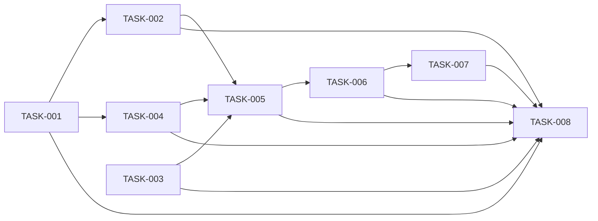

# 08 — Planlama: vitals-log

- Tarih: 2026-08-10 | Mod: AUTOPILOT | Profil: LITE

> LITE: milestone + önceliklendirilmiş backlog.

## Milestone'lar
| M | Hedef | Kapsanan FR'ler | Hedef tarih |
|---|-------|-----------------|-------------|
| M1 | Çalışan uçtan uca uygulama (TDD ile `src/` + `tests/`) | FR-1..6, NFR-1..4 | Faz 9 kapanışı |

## Backlog (önceliklendirilmiş, GitHub Issues formatına uyumlu)

### [M1] TASK-001: derive.js — saf türetim fonksiyonları
- **Tahmin:** ≤ 0.5 gün
- **Bağımlılık:** —
- **FR/NFR:** FR-1 (ortalama+MAP+dilim önerisi), NFR-1 (satır başına ucuz aritmetik)
- **Kabul:** `mean(sys,dia)`, `map(sys,dia)`, `periodFor(hour)`, `enrich(row)` saf fonksiyonlar; `periodFor` saati parametre alır (TZ bağımsız test); Yatsı'nın gece yarısını sarması test edilir; hem `src/derive.js` hem `/js/derive.js` olarak servis edilecek tek kaynak.

### [M1] TASK-002: validate.js — alan doğrulama
- **Tahmin:** ≤ 0.5 gün
- **Bağımlılık:** TASK-001 (derive'a bağımlı — sistolik/diyastolik eşleşmesi + ts normalizasyonu türetimle tutarlı olmalı)
- **FR/NFR:** FR-1 (alan aralıkları), NFR-3 (girdi güvenliği — sınır dışı değer reddi)
- **Kabul:** Saf `validate(input)`: DDL'deki aralıklar (`right_systolic 40-300` vb.) + en az bir ölçüm zorunluluğu + `ts` yoksa `now()` ataması; hatalı girdide `{error:{code,message,field}}` şeklinde yapılandırılmış hata döner.

### [M1] TASK-003: db.js — ReadingStore (node:sqlite)
- **Tahmin:** ≤ 1 gün
- **Bağımlılık:** —
- **FR/NFR:** FR-2, FR-3, FR-4, FR-6, NFR-4 (kalıcılık)
- **Kabul:** `ReadingStore { list, get, create, update, remove }`; açılışta `/app/data` dizinini oluşturur, şemayı (`readings` DDL + `idx_readings_ts`) idempotent uygular; `PRAGMA journal_mode=WAL`, `synchronous=FULL`; `list()` `ORDER BY ts DESC` döner; container restart sonrası veri kalıcılığı testle doğrulanır.

### [M1] TASK-004: csv.js — CSV üretimi
- **Tahmin:** ≤ 0.5 gün
- **Bağımlılık:** TASK-001 (türetilmiş `*_mean`/`*_map` kolonlarını kullanır)
- **FR/NFR:** FR-5
- **Kabul:** Saf `toCsv(rows)`: UTF-8 BOM + CRLF satır sonu + tırnak kaçışı; kolon sırası mimaride tanımlandığı gibi (`ts, time_period, right_systolic, right_diastolic, right_mean, right_map, left_systolic, left_diastolic, left_mean, left_map, fever, pulse, oxygen`).

### [M1] TASK-005: routes/readings.js — HTTP↔domain bağlama
- **Tahmin:** ≤ 1 gün
- **Bağımlılık:** TASK-002, TASK-003, TASK-004
- **FR/NFR:** FR-1..6, NFR-3 (accessGate ile birlikte çalışacak yüzey)
- **Kabul:** 5 uç (`GET/POST /api/readings`, `PUT/DELETE /api/readings/:id`, `GET /api/readings/export.csv`) doğru durum kodlarıyla (`201/200/204/404/400`); validate→db→derive zinciri; hata zarfında yığın izi sızmaz.

### [M1] TASK-006: server.js — middleware zinciri + statik + /health
- **Tahmin:** ≤ 1 gün
- **Bağımlılık:** TASK-005
- **FR/NFR:** NFR-2 (statik dosya servisi), NFR-3 (accessGate kancası + CSP başlıkları)
- **Kabul:** `node:http` sunucusu; middleware sırası: logger → securityHeaders (CSP) → accessGate (geçirgen stub, Faz 7 dolduracak) → jsonBody (≤64 KB) → router; `/health` accessGate'ten muaf; statik dosyalar (`/`, `/app.js`, `/styles.css`, `/js/derive.js`) `Cache-Control: no-cache` ile servis edilir; `MOUNT_PREFIX` ile route'lar tek noktadan mount edilir.

### [M1] TASK-007: public/ — istemci arayüzü
- **Tahmin:** ≤ 1 gün
- **Bağımlılık:** TASK-006
- **FR/NFR:** FR-1, FR-2, FR-3, FR-4, FR-5, NFR-2 (360px mobil)
- **Kabul:** `index.html` (inline script yok) + `app.js` (form ekleme/düzenleme/silme, liste render, `/js/derive.js` ile anlık ortalama/MAP/dilim önerisi, CSV export butonu, göreli `fetch` yolları) + `styles.css` (tek kolon form, 360px altı kart düzeni, yatay kaydırma yok).

### [M1] TASK-008: Entegrasyon testleri + coverage + kapı
- **Tahmin:** ≤ 1 gün
- **Bağımlılık:** TASK-001..007 (tümü)
- **FR/NFR:** NFR-1 (200 satır seed ile uçtan uca süre ölçümü), NFR-4 (restart sonrası veri testi)
- **Kabul:** Uçtan uca API testleri (create→list→update→delete→export.csv), 360px viewport taşma kontrolü notu, `npm test` yeşil, coverage ≥ %70; Faz 9 DL'si yazılır; TDD red→green commit çiftleri task başına ayrı.

## Bağımlılık grafı (kalite kapısı: çevrimsiz)

Sıra: TASK-001, TASK-002/TASK-003 (paralel edilebilir), TASK-004, TASK-005, TASK-006, TASK-007, TASK-008 — geriye kenar yok, çevrim yok.

## Kalite kapısı raporu
- "Her task 1 günden küçük" → ✅ (en uzun tahmin 1 gün — TASK-003, TASK-005, TASK-006, TASK-007, TASK-008; hepsi "≤1 gün" olarak sınırlandı)
- "Bağımlılık grafı çevrimsiz" → ✅ (8 düğüm, tüm kenarlar tek yönlü ileri; topolojik sıra: 001→002/003→004→005→006→007→008, geriye referans yok)
